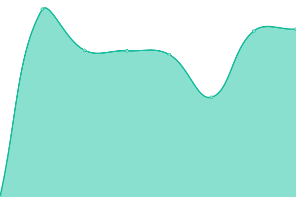

# [📈 Live Status](https://status.skpt.nl): <!--live status--> **🟩 All systems operational**

This repository contains the open-source uptime monitor and status page for [Dennis Volkering](https://dennisvolkering.nl), powered by [Upptime](https://github.com/upptime/upptime).

With [Upptime](https://upptime.js.org), you can get your own unlimited and free uptime monitor and status page, powered entirely by a GitHub repository. We use [Issues](https://github.com/dvolkering/status/issues) as incident reports, [Actions](https://github.com/dvolkering/status/actions) as uptime monitors, and [Pages](https://status.skpt.nl) for the status page.

<!--start: status pages-->
<!-- This summary is generated by Upptime (https://github.com/upptime/upptime) -->
<!-- Do not edit this manually, your changes will be overwritten -->
<!-- prettier-ignore -->
| URL | Status | History | Response Time | Uptime |
| --- | ------ | ------- | ------------- | ------ |
|  [Dennis Volkering](https://dennisvolkering.nl) | 🟩 Up | [dennis-volkering.yml](https://github.com/dvolkering/status/commits/HEAD/history/dennis-volkering.yml) | 

 1079ms
     
 | 

<a href="https://status.skpt.nl/history/dennis-volkering">100.00%</a>
    

|  [Skape IT](https://skape-it.nl) | 🟩 Up | [skape-it.yml](https://github.com/dvolkering/status/commits/HEAD/history/skape-it.yml) | 

 1508ms
     
 | 

<a href="https://status.skpt.nl/history/skape-it">100.00%</a>
    

|  [SVN](https://svnnaaldwijk.nl) | 🟩 Up | [svn.yml](https://github.com/dvolkering/status/commits/HEAD/history/svn.yml) | 

 1428ms
     
 | 

<a href="https://status.skpt.nl/history/svn">100.00%</a>
    

|  [Heijdse Vismaatjeskoor](https://heijdsevismaatjeskoor.nl) | 🟩 Up | [heijdse-vismaatjeskoor.yml](https://github.com/dvolkering/status/commits/HEAD/history/heijdse-vismaatjeskoor.yml) | 

 1345ms
     
 | 

<a href="https://status.skpt.nl/history/heijdse-vismaatjeskoor">100.00%</a>
    

|  [OrchidsOnline](https://orchidsonline.nl) | 🟩 Up | [orchids-online.yml](https://github.com/dvolkering/status/commits/HEAD/history/orchids-online.yml) | 

 2188ms
     
 | 

<a href="https://status.skpt.nl/history/orchids-online">100.00%</a>
    

|  [Skpt](https://skpt.nl) | 🟩 Up | [skpt.yml](https://github.com/dvolkering/status/commits/HEAD/history/skpt.yml) | 

 722ms
     
 | 

<a href="https://status.skpt.nl/history/skpt">100.00%</a>
    

|  [Webmail](https://webmail.skape-it.nl/) | 🟩 Up | [webmail.yml](https://github.com/dvolkering/status/commits/HEAD/history/webmail.yml) | 

 602ms
     
 | 

<a href="https://status.skpt.nl/history/webmail">100.00%</a>
    

|  [Janine de Zeeuw](https://janinedezeeuw.nl) | 🟩 Up | [janine-de-zeeuw.yml](https://github.com/dvolkering/status/commits/HEAD/history/janine-de-zeeuw.yml) | 

 626ms
     
 | 

<a href="https://status.skpt.nl/history/janine-de-zeeuw">100.00%</a>
    

<!--end: status pages-->

[**Visit our status website →**](https://status.skpt.nl)

## 📄 License

- Powered by: [Upptime](https://github.com/upptime/upptime)
- Code: [MIT](./LICENSE) © [Dennis Volkering](https://dennisvolkering.nl)
- Data in the `./history` directory: [Open Database License](https://opendatacommons.org/licenses/odbl/1-0/)
